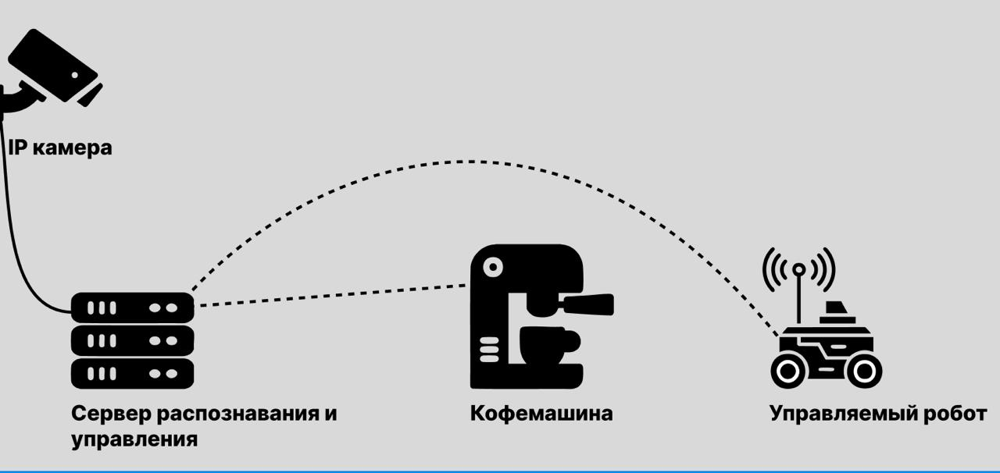
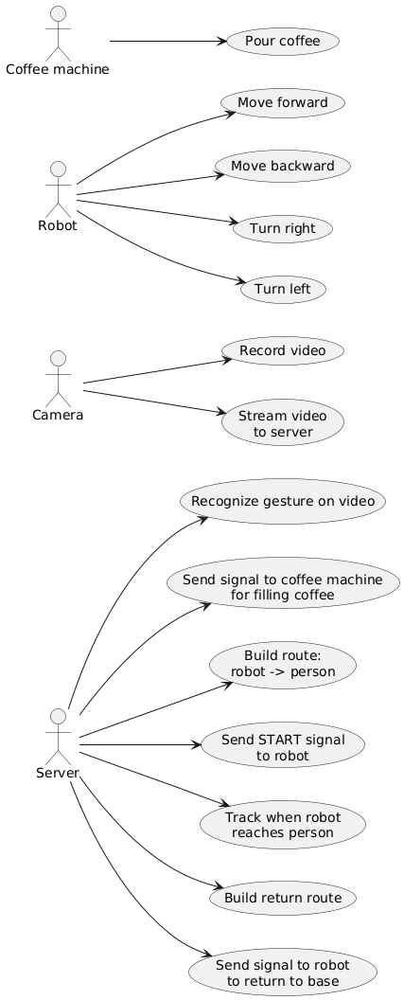
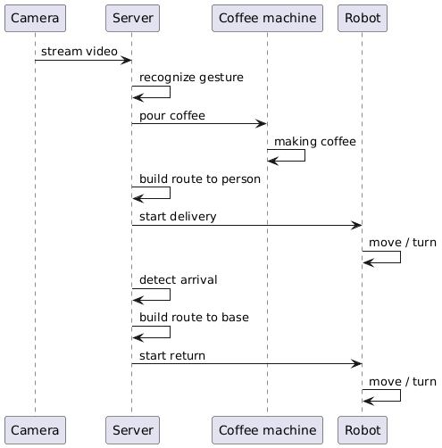
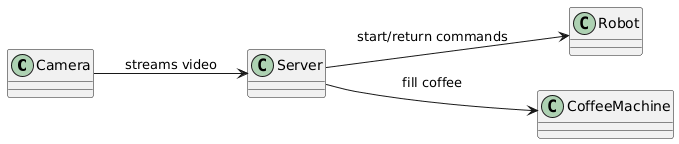
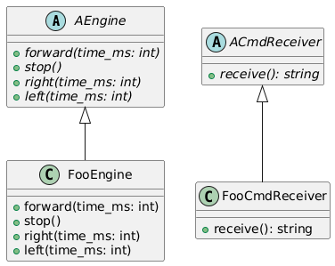

# cofee-bot — gesture-based coffee delivery prototype

Проект демонстрирует прототип системы «жест -> доставка кофе» с двумя реализациями:

- **Python vision/navigation контур**: захват видео, детекция цветовых маркеров, расчёт дистанции/угла до цели и визуализация.
- **C++ control контур**: симуляция исполнительной части робота (движение по командам `forward/right/left/stop`).

Текущий репозиторий — инженерный прототип для лабораторной/исследовательской фазы, а не production-система.

## Состав системы

| Компонент | Реализация | Назначение |
|---|---|---|
| Vision + Navigation | `python/main.py`, `python/detectors.py` | CV-пайплайн по кадрам камеры и расчёт навигационных параметров |
| API endpoint для команд | `python/server.py` | HTTP-вход для передачи команды (в текущем виде без очереди/диспетчера) |
| Engine control prototype | `cpp/classes.h`, `cpp/engine_controll.cpp` | Симуляция реакции движка на текстовые команды |
| Конфигурация CV | `python/config.py` | HSV-диапазоны, фильтрация масок, параметры визуализации |

## Быстрый запуск

### Python vision loop

```bash
cd python
python3 -m venv .venv
source .venv/bin/activate
pip install opencv-python fastapi uvicorn numpy pydantic
python main.py
```

Остановка окна OpenCV: клавиша `q`.

### FastAPI endpoint

```bash
cd python
source .venv/bin/activate
python server.py
```

URL: `http://localhost:8080/docs`.

### C++ control prototype

На текущем этапе `CMakeLists.txt` не соответствует фактической структуре файлов (ожидает `src/...`), поэтому для быстрого локального прогона используйте прямую сборку:

```bash
cd cpp
g++ -std=c++11 engine_controll.cpp -o engine_controll
./engine_controll
```

## Диаграммы

### Технический комплекс

Показывает физическую и сетевую топологию стенда: камера, сервер, кофемашина и робот, а также их каналы связи на уровне системы.



### Use-case диаграмма

Фиксирует функциональные сценарии по участникам системы: какие действия инициирует пользователь и какие сервисные функции выполняют сервер, камера, кофемашина и робот.



### Sequence диаграмма

Отражает основной порядок выполнения операций во времени: от детекции жеста и старта приготовления кофе до доставки, фиксации прибытия и возврата робота на базу.



### Концептуальная модель

Описывает ключевые сущности и их связи на уровне предметной области: поток видео в сервер и управляющие команды от сервера к исполнительным компонентам.



### UML диаграмма классов

Показывает структуру классов и ответственность модулей прототипа, включая обработку команд, навигационную логику и взаимодействие компонентов.



## Документация

- [docs/runbook.md](docs/runbook.md) — runbook запуска и диагностики
- [docs/vision-navigation.md](docs/vision-navigation.md) — контракт CV/навигационного пайплайна
- [docs/api.md](docs/api.md) — API-контракт `POST /command`
- [docs/models.md](docs/models.md) — модели данных Python-части
- [docs/engine-control.md](docs/engine-control.md) — C++ контур управления

## Ограничения текущего состояния

- Интеграция между `python/main.py`, `python/server.py` и C++ контроллером не реализована как единый runtime-контур.
- `POST /command` принимает команду и возвращает подтверждение, но не передаёт её в исполнительный движок.
- Расчёт дистанции зависит от `robot_size` и калибровки сцены; без калибровки значение в см условное.
- В проекте нет lock-файла зависимостей (`requirements.txt`), окружение собирается вручную.
